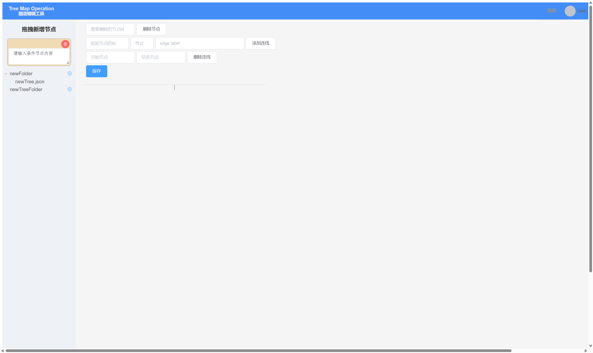

<h2 align="center">一个基于Butterfly-vue的决策树编辑器</h2>

## 页面展示
<p align="center">
  
</p>

## 安装
### Vue安装
```
npm install
```
### FastAPI服务器安装
```
pip install -r requirement.txt
```

## 运行
```
npm run serve
```
### 首页
首页是 Web/src/views/HomeView.vue 

使用到了butterfly组件来绘制决策树，官网为：
[butterfly](https://github.com/alibaba/butterfly)
需要自己查看官网教程，学习怎么使用

### 后端接口
Web/src/api/api.js 这个是接口列表，所有的接口都在这里声明，然后在其他页面import使用


## FastAPI服务端
FastAPI服务器在web-server目录下

### 运行
```
python main.py
```
运行时需要修改下面这句代码中的host和port，修改成自己服务器的ip地址和端口号
```
uvicorn.run('server:app', host='*', port=13333, reload=True)
```
